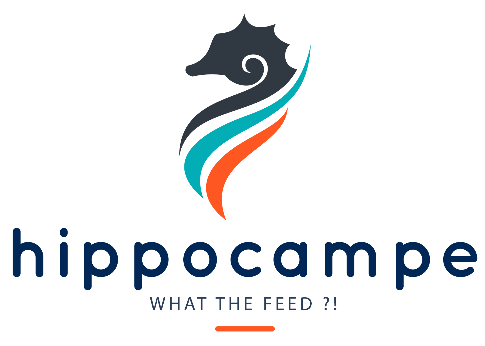

**Hippocampe** is a threat feed aggregator. It gives your organisation a threat feed 'memory' and lets you query it easily through a REST API or from a Web UI. If you have a [Cortex](https://github.com/CERT-BDF/Cortex) server, there's already an analyzer to query Hippocampe. And if you use [TheHive](https://github.com/CERT-BDF/TheHive) as a security incident response platform, you can customize the JSON output produced by the analyzer to your taste or use the report template that we kindly provide.

Hippocampe aggregates feeds from the Internet in an Elasticsearch cluster. It has a REST API which allows to search into its 'memory'. It is based on a Python script which fetchs URLs corresponding to feeds, parses and indexes them.

# Hipposcore
Hippocampe allows analysts to configure a confidence level for each feed that can be changed over time and when queried, it will provide a score called Hipposcore that will aid the analyst decide whether the analyzed observables are innocuous or rather malicious.

# License
Hippocampe is an open source and free software released under the [AGPL](https://github.com/CERT-BDF/Cortex/blob/master/LICENSE) (Affero General Public License). We, TheHive Project, are committed to ensure that Hippocampe will remain a free and open source project on the long-run.

# Roadmap
 * Extracting observable or IOCs from an email or a report 
 * Adding data manually
 * Distinguish fields generate by Hippocampe from those generated by feeds
 * Show related data (eg, when searching for a URL, show the domain as related if hippocampe knows it)
 * Index MISP attributes

# Updates
Information, news and updates are regularly posted on [TheHive Project Twitter account](https://twitter.com/thehive_project) and on [the blog](https://blog.thehive-project.org/).

# Contributing
We welcome your contributions. Please feel free to fork the code, play with it, make some patches and send us pull requests.

# Support
Please [open an issue on GitHub](https://github.com/CERT-BDF/Hippocampe/issues/new) if you'd like to report a bug or request a feature.

Alternatively, if you need to contact the project team, send an email to <support@thehive-project.org>.

# Community Discussions
We have set up a Google forum at <https://groups.google.com/a/thehive-project.org/d/forum/users>. To request access, you need a Google account. You may create one [using a Gmail address](https://accounts.google.com/SignUp?hl=en) or [without one](https://accounts.google.com/SignUpWithoutGmail?hl=en).

# Website
<https://thehive-project.org/>
