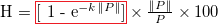
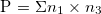
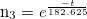
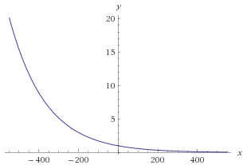
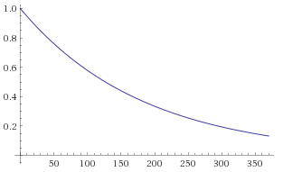
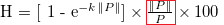

# Hipposcore

The Hipposcore is inspired from the capacitor's charge formula and is:


The formula is a product with three parts. Let's explain each.

## The percentage


The easiest part is the third term ``` * 100 ```.     
It is used to make the score as a percentage.

## The main part



The main part is the most tricky one.

### The blind-full confidence

First it has ```1``` because each intel is believed as trustworthy with the maximum value (1), **at the beginning**. 

Then value is subtracted from this blind-full confidence, and to be precise ```exp(-k |P|)``` is subtracted.

> But why exp(-k |P|) ? Where does it come from ?    

To understand that, let's have a look at ```P```.

### P: source's confidence, time factor and occurrences



With:    


* ```n1```: source's score
* ```n3```: timeFactor function, depends on the intel's age

> Why is a sum needed ?

The Hipposcore takes in consideration the source's confidence (where the intel comes from) thanks to the source's score  and the time factor (the more old an intel is, the less it is relevant).     
If the intel is listed in several feeds, this also has to be taken in count. And it is done with the sum.

Let's illustrate this with an example and calculate ```P``` for the domain ```evil.com```.

Some problem data:  


```evil.com``` is listed in:
 
   * the feed ```superFeed```
   * the feed ```hyperFeed```


```superFeed``` source score is ```-100``` and ```hyperFeed``` source score is ```-90```.


```evil.com``` was last listed in

   * ```superFeed``` 2 days ago
   * ```hyperFeed``` 3 days ago

From that P is:

```
    P = sum[n1 * n3]
    
<=> P = [n1 superFeed * n3 superFeed] + [n1 hyperFeed * n3 hyperFeed]
        
<=> P = [superFeed source's score * timeFactor(intel age in superFeed)] + [hyperFeed source's score * timeFactor(intel age in hyperFeed)]
 
```

> How does the timeFactor function works ?


#### timeFactor function

As said earlier, the more old an intel is and the less it is relevant.     


If the intel is too old, ```n3``` must be smaller and have less impact on the result.    


To do so ```n3``` is:




With ```t```: intel's age

> In how is it a time factor formula ?

Let's have a look at the function:



From the graph, the function tends to 0 when the intel's age increase.



If the intel is one year old (```t = 365```), ```n3``` wil be less than ```0.2``` but if it is fresh from today (```t = 0```) ```n3``` will be at the max value which is 1.

> But why 182.625 in the n3 formula ?

Let's have a look at some interesting value of ```n3``` in time:

|  Example  |  1  |  2  |  3  |
|  -------  | --- | --- | --- |
|  t  |  0  |  182.625  |  365  |    
|  n3  |  1  |  0.37  |  0.13  |    

```182.625``` is the period, it means that when the intel's age reaches this value (```t = 182.625```), ```n3``` will lose **63%** of its origin value (when ```t = 0```).   

And if you have not noticed yet, ```182.625``` is equivalent to 6 months.     

So after 6 months ```n3``` loses **63%**.    


This **63%** decrease is a physics/mathematics fact.

With these additional details we can get back to ```P```:


```
    P = sum[n1 * n3]
    
<=> P = [n1 superFeed * n3 superFeed] + [n1 hyperFeed * n3 hyperFeed]
        
<=> P = [superFeed source's score * timeFactor(intel age in superFeed)] + [hyperFeed source's score * timeFactor(intel age in hyperFeed)]


#Resuming the calculation with values previously given:

<=> P = [-100 * exp(-2 / 182.625)] + [-90 * exp(-3 / 182.625)]

<=> P = [-100 * 0.99] + [-90 * 0.98]

<=> P = -99 + -88.2

<=> P = -187.2
 
```

> Hum I understand that P is a combination of the source's confidence, the time factor and the number of time the intel occurs but don't really see the point...

If you understand that so far, it is very good but please keep hanging on (told you it was the tricky part). Remember this ```exp(-k |P|)``` ? Let's do some math:

First consider ```exp(-k P)```, P can be any value between ```[-infinite ; +infinite]``` but if P is between ```[-infinite ; 0]``` the result will be between ```[+infinite ; 1]```.

Since the *blind-full confidence* is set to ```1``` we cannot subtract more trust than ```1```. It does not make sense.    

Thankfully, if P is between ```[0 ; +infinite]```, the result will be between ```[1 ; 0]``` so **the more ```P``` is big and the less trust will be subtracted**.
Moreover, it also means that **```[1 - exp( -k |P|)]``` is always positive**.


Below a french variation table sums up the behavior of ```exp(-k x)``` (to map with our use case, assume that ```x``` is equivalent to ```P```):


> But we can't force P to be positive. Can we ?

In fact, no we cannot force ```P``` to be positive.   

However, thanks to the absolute value function, we can force ```P``` to be positive **in the exponential function only**. And that answer why ```exp(-k |P|)```.

> Wait... What about k ? What is its purpose ??

```k``` act like an amplifier/attenuator. At same value of ```P```, the more negative ```k``` is, the more trust will be subtracted. In the other hand, always at same value of ```P```, the more positive ```k``` is, the less trust will be subtracted:

|  Example  |  1  |  2  |  3  |  4  |  5  |  6  |
| --------  | --- | --- | --- | --- | --- | --- |
|  ```|P|```  |  1  |  1  |  1  |  1  |  1  |  1  |     
|  ```k```  |  1  |  2  |  4  | -1  |  -2  |  -4  |     
|  ```exp(-k |P|) (trust to be subtracted)```  |  0.37  |  0.14  |  0.02  |  2.7  |  7.4  |  54.6 |     

For your information, we set ```k``` with the value ```2```.


## Malicious or not ?



Finally the last part.


Until now, we have just subtracted some trust (based on source's confidence, time factor and intel's occurrences among several feeds) to a Hipposcore set at maximum value (1).    


But no hints on whether or not it is malicious.    


This categorization is done through that last part, the sign part.   


Again P is


With:    


* ```n1```: source's score
* ```n3```: timeFactor function, depends on the intel's age    
 


If the intel is malicious, its source's score is negative and P is negative as well.      
If the intel is not malicious, its source's score is positive and P is positive.    


So two uses cases:

* intel is malicious => ```n1``` is negative => P is negative => ```|P| / P = -1```
   * so the Hipposcore is negative
* intel is not malicious => ```n1``` is negative => P is positive => ```|P| / P = 1```
   * so the Hipposcore is positive

A negative Hipposcore means it is malicious and the higher the value is and the more confidence we have.   

A positive Hipposcore means it is not malicious and the same rule applied: the higher the value is and the more confidence we have.

