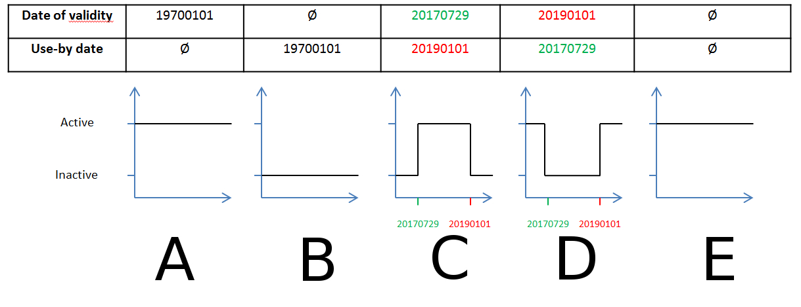

#Tutorial

You will find bellow a "step by step" documentation on "*How to use Hippocampe*".

##Installation
First make sure you followed the [install guide](install_guide.md) before we get started.

##Use-cases
Now we are ready to go !
If it is the first time you use *Hippocampe*, just follow the tutorial.
If you are in a hurry, go directly to the subject you are interrested in:

+ Basic usage:
    + [How to retrieve feeds ?](#how-to-retrieve-feeds)
    + [Did we successfully retrieve feeds ?](#did-we-successfully-retrieve-feeds)
    + [How to query Hippocampe ?](#how-to-query-hippocampe)
    + [How to add a new source ?](#how-to-add-a-new-source)
        + [source](#source)
        + [elasticsearch](#elasticsearch)
        + [intel](#intel)
    + [How to get more details about your sources ?](#how-to-get-more-details-about-your-sources)
    + [logs](#logs)
+ Advanced usage:
    + [Retrieve feeds automatically and periodically](#retrieve-feeds-automatically-and-periodically)
    + [Activate or deactivate a feed](#activate-or-deactivate-a-feed)
    + [Monitor the sources](#monitor-the-sources)
    + [How to get every distinct value ?](#how-to-get-every-distinct-value)
    + [New intelligence](#new-intelligence)
    + [Interresting Hippocampe data](#interresting-hippocampe-data)
        + [freshness](#freshness)
        + [lastQuery](#lastquery)
        + [schedReport](#schedreport)
        + [sizeBySources](#sizebysources)
        + [sizeByTypes](#sizebytype)
    + [How to configure Hippocampe ?](#how-to-configure-hippocampe)
        + [auth](#auth)
        + [feeds](#feeds)
        + [hippo](#hippo)
    + [docker](#docker)
        + [log location](#log-location)
        + [elasticsearch files](#elasticsearch-files)
        + [conf location](#conf-location)
        + [changing port](#changing-port)


***

##How to retrieve feeds

You sucessfully installed *Hippocampe* and launched the api (```python app.py``). Your elasticsearch server is also on ;-)

Now, let's retrieve feeds.
Just execute an http GET on ```localhost:5000/hippocampe/api/v1.0/shadowbook```.

**Query**:
```
curl -XGET localhost:5000/hippocampe/api/v1.0/shadowbook

```
**Response**:
```
{
  "job": {
    "AVSQjAYZGLawP2pF8zFV": "ongoing"
  }
}
```

The job is now running in background and is indentified by its id: ```AVSQjAYZGLawP2pF8zFV```.


***

##Did we successfully retrieve feeds ?

After a few minutes (depending on your machine and your sources), the job should finished.

GET the following url ```http://localhost:5000/hippocampe/api/v1.0/jobs``` for more details:

**Query**:
```
curl -GET http://localhost:5000/hippocampe/api/v1.0/jobs
```

**Response**:
```
{
  "AVSQjAYZGLawP2pF8zFV": {
    "duration": "6.52",
    "endTime": "20160506T142317+0200",
    "report": {
      "ET_IP.conf": {
        "activated": true,
        "error": [],
        "link": "http://rules.emergingthreats.net/blockrules/compromised-ips.txt",
        "nbFailed": 0,
        "nbIndex": 1158,
        "nbNew": 1062,
        "nbUpdate": 0
      },
      "snort_IP.conf": {
        "activated": true,
        "error": [],
        "link": "http://labs.snort.org/feeds/ip-filter.blf",
        "nbFailed": 0,
        "nbIndex": 40365,
        "nbNew": 39841,
        "nbUpdate": 0
      }
    },
    "startTime": "20160506T141646+0200",
    "status": "done"
  }
```

It provides us some informations, let's focus on these:

```
    "report": {
      "ET_IP.conf": {
        "activated": true,
        "error": [],
        "link": "http://rules.emergingthreats.net/blockrules/compromised-ips.txt",
        "nbFailed": 0,
        "nbIndex": 1158,
        "nbNew": 1062,
        "nbUpdate": 3
      },
      "snort_IP.conf": {
        "activated": true,
        "error": [],
        "link": "http://labs.snort.org/feeds/ip-filter.blf",
        "nbFailed": 0,
        "nbIndex": 40365,
        "nbNew": 39841,
        "nbUpdate": 0
      }
    },
```

It precises us that 2 feeds have been querried ```http://rules.emergingthreats.net/blockrules/compromised-ips.txt``` and ```http://labs.snort.org/feeds/ip-filter.blf```.
Theirs respectives configuration files are ```ET_IP.conf``` and ```snort_IP.conf```.

If we focus on the ```emergingthreats``` feed, we noticed that there are ```1158``` elements indexed and amongst them ```1062``` were not previously known. At last, ```3``` are already known and their ```lastAppearance``` date have been updated.

Please note that the ```jobs``` service returns every jobs launched since "*day one*". It does not return only the last job.

***

###How to query Hippocampe ?

During your daily analyst work, you encounter 2 ips and 1 url:

+ hxxp://www.mkpoytuyr.com/f/
+ 199[.]9[.]24[.]1
+ 223[.]184[.]173[.]74

You suspect them to be malicious.
Let's query *Hippocampe*, it might have more details:

**Query**:
```
curl -i -H "Content-Type: application/json" -X POST -d '
{
        "http://www.mkpoytuyr.com/f/" : {"type" : "url"},
        "199.9.24.1" : {"type" : "ip"},
        "223.184.173.74" : {"type" : "ip"}
}' http://localhost:5000/hippocampe/api/v1.0/more
```
**Response**:
```
{
  "199.9.24.1": [], 
  "223.184.173.74": [
    {
      "firstAppearance": "20160505T180916+0200", 
      "hipposcore": {
        "hipposcore": -98.12798922301901
      }, 
      "idSource": "AVSBria00AEA_f3Kf714", 
      "ip": "223.184.173.74", 
      "lastAppearance": "20160521T180916+0200", 
      "source": "https://feodotracker.abuse.ch/blocklist/?download=ipblocklist"
    }, 
    {
      "firstAppearance": "20160505T180837+0200", 
      "hipposcore": {
        "hipposcore": -98.12798922301901
      }, 
      "idSource": "AVSBrTzd0AEA_f3KfbZ4", 
      "ip": "223.184.173.74", 
      "lastAppearance": "20160521T180837+0200", 
      "source": "http://labs.snort.org/feeds/ip-filter.blf"
    }
  ], 
  "http://www.mkpoytuyr.com/f/": []
}
```

Now, according to *Hippocampe*'s response, it does not know ```hxxp://www.mkpoytuyr.com/f/``` nor ```199[.]9[.]24[.]1```.

However, ```223[.]184[.]173[.]74``` is known by 2 sources: ```feodotracker.abuse.ch``` and ```labs.snort.org```.

The first time this ip appeared in ```feodotracker.abuse.ch``` was on ```20160505T180916+0200``` (firstAppearance) and the last time was on ```20160521T170000+0200``` (lastAppearance).

***

###How to add a new source ?

Each source has its configuration file. To add a source, a configuration file needs to be added in ```Hippocampe/core/conf/feeds```.

Below an example of configuration file:

```
[source]
url : http://mirror1.malwaredomains.com/files/domains.txt
delimiter : \t
beginWithBlank : True
fields : ["nextvalidation", "domain", "type", "original_reference-why_it_was_listed"]
extraFields : extra
description : DNS-BH - Malware Domain Blacklist. A list of domains that are known to be used to propagate malware are listed in Bind and Windows zone files. The domains are loaded onto an internal DNS server. When a computer requests a URL or file from one of these domains, a fake reply is sent, thus preventing many malware installs from occuring.
startAt : 4
score : -100
coreIntelligence : domain
validityDate:
useByDate:

[elasticsearch]
typeIntel = malwaredomainsFree_dnsbhDOMAIN

[intel]
nextvalidation = {
	"mapping" : {
		"type": "string",
		"index": "not_analyzed"
		}
	}


domain = {
	"mapping" : {
		"type": "string",
		"index": "not_analyzed"
		}
	}


type = {
	"mapping" : {
		"type": "string",
		"index": "not_analyzed"
		}
	}


original_reference-why_it_was_listed = {
	"mapping" : {
		"type": "string",
		"index": "not_analyzed"
		}
	}


extra = {
	"mapping" : {
		"type": "string",
		"index": "not_analyzed"
		}
	}
```

The conf file follows the Configparser syntax.
There are 3 sections:

+ source
+ elasticsearch
+ intel

####source
Bellow how to fill in the source section:

+ url : *the url where to fetch the source*
    + ```url : http://mirror1.malwaredomains.com/files/domains.txt```
+ delimiter : *the delimiter used to parse the source*
    + ```delimiter : \t```
+ beginWithBlank: *Sometimes the source's first row (after parsing) can be empty, in that case, hippocampe has to know it.
    + ```beginWithBlank : True```
+ fields: *All the field names in the right order between quote and in square bracket. Moreover, each field names have to be lower case.*
    + ```fields : ["nextvalidation", "domain", "type", "original_reference-why_it_was_listed"]```
+ extraFields: *It is used as an extra label, if a row does not have a label, it will be labeled with $extraFields.
    + ```extraFields : extra```
+ description: *source's description on one line*
    + ```description : DNS-BH - Malware Domain Blacklist. A list of domains that are known to be used to propagate malware are listed in Bind and Windows zone files. The domains are loaded onto an internal DNS server. When a computer requests a URL or file from one of these domains, a fake reply is sent, thus preventing many malware installs from occuring.```
+ startAt: *if the source needs to be parsed from a specific line, notice that the first line is line 0*
    + ```startAt : 4```
+ score: *The source is scored within [+100 ; -100]. -100: intelligences from the source are malicious (because of the minus) and there is a 100% confidence in the source.*
    + ```score : -100```
+ coreIntelligence: *the main intelligence type*
    + ```coreIntelligence : domain```
+ validityDate: *Optional value but the option is required, more details in [Activate/desactivate a feed](#Activate/deactivate a feed)*
    + ```validityDate: ```
+ useByDate: *Optional value but the option is required, more details in [Activate/desactivate a feed](#Activate/deactivate a feed)*
    + ```useByDate: ```

####elasticsearch
Bellow how to fill in the elasticsearch section:

+ typeIntel: the elasticsearch's type under wich intelligences will be indexed```
    + ```typeIntel = malwaredomainsFree_dnsbhDOMAIN```


####intel
For each field in ```fields : ["nextvalidation", "domain", "type", "original_reference-why_it_was_listed"]``` (and for the optional extrafield) an option needs to be created under ```intel``` section.
The value associated will be the elasticsearch mapping:
```
[intel]
nextvalidation = {
	"mapping" : {
		"type": "string",
		"index": "not_analyzed"
		}
	}


domain = {
	"mapping" : {
		"type": "string",
		"index": "not_analyzed"
		}
	}


type = {
	"mapping" : {
		"type": "string",
		"index": "not_analyzed"
		}
	}


original_reference-why_it_was_listed = {
	"mapping" : {
		"type": "string",
		"index": "not_analyzed"
		}
	}


extra = {
	"mapping" : {
		"type": "string",
		"index": "not_analyzed"
		}
	}
```

More about mapping [here](http://www.elastic.co/guide/en/elasticsearch/reference/1.7/mapping.html).  
More about elasticsearch type [here](https://www.elastic.co/guide/en/elasticsearch/reference/1.7/mapping-types.html).  
More information about date & mapping [here](https://www.elastic.co/guide/en/elasticsearch/reference/1.7/mapping-date-format.html).

***

###How to get more details about your sources ?
Hit the url ```http://localhost:5000/hippocampe/api/v1.0/sources``` with a http GET to retrieve all your sources.

**Query**:
```
curl -GET http://localhost:5000/hippocampe/api/v1.0/sources

```

**Response**:
```
{
  "http://autoshun.org/files/shunlist.csv": {
    "coreIntelligence": "ip",
    "description": "AutoShun is a Snort plugin that allows you to send your Snort IDS logs to a centralized server that will correlate attacks from your sensor logs with other snort sensors, honeypots, and mail filters from around the world. The input from your logs will be used to identify hostile address that are bots, worms, spam engines which we use to build a shun list.",
    "firstQuery": "20160508T201602+0200",
    "lastQuery": "20160508T201602+0200",
    "link": "http://autoshun.org/files/shunlist.csv",
    "score": -100,
    "type": "autoshunFree_shunlistIP"
  },
  "http://data.phishtank.com/data/online-valid.csv": {
    "coreIntelligence": "url",
    "description": "PhishTank is a collaborative clearing house for data and information about phishing on the Internet",
    "firstQuery": "20160508T201617+0200",
    "lastQuery": "20160508T201617+0200",
    "link": "http://data.phishtank.com/data/online-valid.csv",
    "score": -100,
    "type": "phishtankFree_onlinevalidURL"
  },
  "http://labs.snort.org/feeds/ip-filter.blf": {
    "coreIntelligence": "ip",
    "description": "IP blacklist from labs.snort.org which is an undertaking by the Sourcefire VRT.",
    "firstQuery": "20160508T201511+0200",
    "lastQuery": "20160508T201511+0200",
    "link": "http://labs.snort.org/feeds/ip-filter.blf",
    "score": -100,
    "type": "snortFree_filterIP"
  }
}
```

The response is a JSON doc which each keys are source's urls.
The values associated to the key are the matadata:

+ *coreIntelligence* is the observable's type found in the feed
+ *description* is a short description of the feed
+ *firstQuery* is the first querried date of the feed
+ *lastQuery* is the last querried date of the feed
+ *link* is the feed's url
+ *score* is the feed's score of confidence
+ *type* is the elasticsearch's type under wich the intelligences are stored

***

###logs

Hippocampe logs are located at ```Hippocampe/core/logs/hippocampe.log```.

***

###Retrieve feeds automatically and periodically

*Hippocampe* retrieves threat intelligence from internet's feed to index it. This is done through [shadowbook](#shadowbook) service.
*hipposched* allows to schedule automaticaly the launch of  [shadowbook](#shadowbook), in other words automatic indexation is possible.
The crontab syntax is used to indicate the job's frequency.
###Example
+ Indexation every 12 hours
**Query**:
```
curl -i -H "Content-Type: application/json" -X POST -d '
{
        "time" : "* */12 * * *"
}' http://localhost:5000/hippocampe/api/v1.0/hipposched
```
**Response**:
```
{
  "schedule": "* */12 * * *"
}
```

Please be aware that: 

+ the scheduling is stored in *memory*, if the API is stopped and started again, another query has to be sent to schedule jobs
+ yet, there is no way to get the scheduled frequency from the API
    + looking for the string ```job succesfully schedulled as: * */12 * * *``` in the log can be a workaround
+ if a shadowbook job is already running, as a job A, and another one is about to be launched because of *hipposched*, as a job B
    + job B would be launched after the end of job A

***

###Activate or deactivate a feed

When shadowbook is launched, feed can be deactivated. In other words, they will not be querried nor processed.
In the feed's conf file, ```validityDate``` and ```useByDate``` under ```source``` section are used to this purpose.

Five cases are handled by Hippocampe:



+ A case
    + Only the validityDate is filled in. Whatever the date is, the feed is always activated.
+ B case
    + Only the useByDate is filled in. Whatever the date is, the feed is always deactivated.
+ C case
    + The validityDate and the useByDate are filled in & ```validityDate < useByDate```. The feed is only activated between the validityDate and the useByDate.
+ D case
    + The validityDate and the useByDate are filled in & ```validityDate > useByDate```. The feed is  deactivated between the validityDate and the useByDate.
+ E case
    + Neither the validityDate neither the useByDate are filled in. The feed is always activated.

***

###"Monitor" the sources

With time, the number of sources will increase and you may want to have a global vision on them.

Hit the ```/hippocampe/api/v1.0/monitorSources``` url to have some interresting metadata about your sources:

###Example
**Query**:
```
curl -GET http://localhost:5000/hippocampe/api/v1.0/monitorSources
```
**Response**:
```
{
  "http://autoshun.org/files/shunlist.csv": {
    "freshness": "OK", 
    "lastQuery": "20160505T180913+0200", 
    "schedReport": "NOK", 
    "size": 500
  }, 
  "http://data.phishtank.com/data/online-valid.csv": {
    "freshness": "OK", 
    "lastQuery": "20160505T180932+0200", 
    "schedReport": "NOK", 
    "size": 0
  }, 
  "http://labs.snort.org/feeds/ip-filter.blf": {
    "freshness": "OK", 
    "lastQuery": "20160505T180814+0200", 
    "schedReport": "NOK", 
    "size": 39399
  }
}
```

For each sources' url, four keys are associated:

+ freshness: the value is either ```OK``` or ```NOK```
    + ```OK```, by default when the source has been querried within the last day
    + ```NOK``` if not
+ lastQuery: lastQuery date of the source
+ schedReport: the value is either ```OK``` or ```NOK```
    + ```OK```, by default when the source has been querried within the last twelve hours
    + ```NOK``` if not    
+ size: number of element indexed from the source

Check [freshness](#freshness) and [schedReport](#schedreport) for more details.

***

###How to get every distinct value ?

Somehow,  you may want to get every distinct ip, domain, url, fqdn, etc...

To do so, just precise what types you want according to the following example:

**Query**:
```
curl -i -H "Content-Type: application/json" -X POST -d '
{
        "field" : ["ip", "url"]
}' http://localhost:5000/hippocampe/api/v1.0/distinct
```
**Response**:
```
{
  "ip": [
    "8.8.8.8",
    "0.0.0.0"
	],
   "url": [
	"http://www.evil.com/malicious.exe",
	"http://www.evil.com/veryMalicious.exe"
	]
}

```

***

###New Intelligence

When shadowbook is launched, it indexed intelligence in elasticsearch. If the intelligence is new, in the meaning of never seen before by any of your sources, the intelligence is indexed under the source's type (in elasticsearch vocabulary) and under the type "new".

That way, you can retrieve the all new intelligence:

**Query**:
```
curl -GET http://localhost:5000/hippocampe/api/v1.0/new
```
**Response**:
```
{
  "AVSBrS-10AEA_f3KfZr-": {
    "toSearch": "http://www.badevil.org/malicious.EXE",
    "type": "url"
  },
  "AVSBrYyN0AEA_f3KfgJi": {
    "toSearch": "14.141.209.194", 
    "type": "ip"
  }
}
```

***

###Interresting Hippocampe data

We previously introduced how to [monitor the sources](#monitor-the-sources). Each data from the monitoring can be retrieve independently:

#### freshness
*freshness* service checks if your feeds are "up to date".
In ```Hippocampe/core/conf/hippo/hippo.conf``` a threshold can be defined, by default it is setted to 1 day:
```
[freshness]
#in days
threshold : 1
```
If the feed has not been querried within the last day, the service returns "NOK", otherwise it returns "OK".
#####Example
**Query**:
```
curl -GET http://localhost:5000/hippocampe/api/v1.0/freshness
```

**Response**:
```
{
  "http://autoshun.org/files/shunlist.csv": {
    "freshness": "OK"
  },
  "http://data.phishtank.com/data/online-valid.csv": {
    "freshness": "NOK"
  },
  "http://labs.snort.org/feeds/ip-filter.blf": {
    "freshness": "OK"
  }
```

####lastQuery
*lastQuery* returns the last query date for every sources. samedi, 07. mai 2016 03:50 
he date format is ```"%Y%m%dT%H%M%S%z"```
#####Example
**Query**:
```
curl -GET http://localhost:5000/hippocampe/api/v1.0/lastQuery
```
**Response**:
```
{
  "http://autoshun.org/files/shunlist.csv": {
    "lastQuery": "20160505T180913+0200"
  }, 
  "http://data.phishtank.com/data/online-valid.csv": {
    "lastQuery": "20160505T180932+0200"
  }
}
```

####schedReport
By [retrieveing feeds automatically and periodically](#retrieve-feeds-automatically-and-periodically), indexation can be scheduled.
If the indexation is scheduled every 12 hours, *schedReport* checks if an indexation has been launched in the last 12 hours. If so, it returns ```OK```, if not it returns ```NOK``` for every sources.
The threshold is defined in ```Hippocampe/core/conf/hippo/hippo.conf```:
```
[schedReport]
#in hours 
threshold: 12
```
#####Example
**Query**:
```
curl -GET http://localhost:5000/hippocampe/api/v1.0/schedReport

```
**Response**:
```
{
  "http://malwareurls.joxeankoret.com/normal.txt": {
    "schedReport": "OK"
  }
}
```

####sizeBySources

*sizeBySource* service returns  the size's source (number of element) for every sources.

#####Example
**Query**:
```
curl -GET http://localhost:5000/hippocampe/api/v1.0/sizeBySources
```

**Response**:
```
{
  "http://autoshun.org/files/shunlist.csv": {
    "size": 500
  }, 
  "http://labs.snort.org/feeds/ip-filter.blf": {
    "size": 40838
  }
}
```

####sizeByType
*sizeByType* service returns  the number of element for each observable's type.

#####Example
**Query**:
```
curl -GET http://localhost:5000/hippocampe/api/v1.0/sizeByType

```

**Response**:
```
{
  "domain": {
    "size": 31050
  }, 
  "ip": {
    "size": 186848
  }, 
  "url": {
    "size": 8323
  }
}
```

###How to configure Hippocampe ?
If you use Hippocampe in a docker, please check [this](#docker) first.

The default configuration should be fine, but if you need to change it go to ```Hippocampe/core/conf```.

####auth
Some feeds are private and need authentification with login/password. Precise the top_level_url and your login/password in  ```Hippocampe/core/conf/auth/auth.conf```

#####Example:
```
[top_level_url1]
username: user1
password : passwd1

[top_level_url2]
username: user2
password : passwd2

```

####feeds
Refer to [How to add a new source ?](#how-to-add-a-new-source).

####hippo

In  ```Hippocampe/core/conf/hippo/hippo.conf``` you can configure:

+ the flask API
    + and especially the port
+ elasticsearch
    + fill in the address and the port of your elasticsearch's server if it is not on the same computer. All the data are indexed under the index ```hippocampe```but you can change that if you want. Same for types ```source```, ```new```, ```jobs```.
+ freshness
    + Refer to [freshness](#freshness)
+ schedReport
    + Refer to [schedReport](#schedreport)


```
[api]
debug : False
host : 0.0.0.0
port : 5000
threaded : True

[elasticsearch]
ip : 127.0.0.1
port : 9200
#indexNameES MUST BE LOWERCASE
indexNameES : hippocampe
typeNameESSource : source
typeNameESNew : new
typeNameESJobs: jobs

[freshness]
#in days
threshold : 1

[schedReport]
#in hours 
threshold: 12
```
***

###docker
Some information need to be known while using Hippocampe with docker.

####log location
Hippocampe's logs are located at ```Hippocampe/packaging/volumeHippo/logs/hippocampe.log```.

####elasticsearch files
elasticsearch's files are located at:

+ data: ```Hippocampe/packaging/volumeES/data```
+ conf: ```Hippocampe/packaging/volumeES/conf```
+ logs: ```Hippocampe/packaging/volumeES/logs```

####Configuration location

Hippocampe configuration which is applied inside the docker is located at ```Hippocampe/packaging/volumeHippo/conf```. Have a look at [this](#how-to-configure-hippocampe) to fill in the conf.

####Changing port

If you would like to change the port used by the API, **do not change it in the ```Hippocampe/packaging/volumeES/conf/hippo/hippo.conf``` file**.

Follow these steps instead to change from port 5000 to 5001, for example:

+ In ```Hippocampe/core/Dockerfile``` look for ```EXPOSE 5000:5000``` and change it into ```EXPOSE 5001:5000```
+ In ```Hippocampe/packaging/run.sh``` look for ```docker run -p 5000:5000 \``` and change it into ```docker run -p 5001:5000 \```
+ Launch ```Hippocampe/packaging/build.sh```
+ Launch ```Hippocampe/packaging/run.sh```

Now Hippocampe is available on port 5001 and runs inside a docker.
